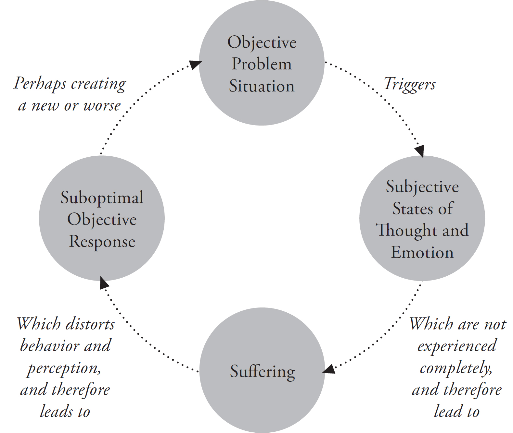

# Chapter 2 — The Most Fundamental Skill

*From: Shinzen Young — The Science of Enlightenment: How Meditation Works (Sounds True, 2016)*

CHAPTER TWO

The Most Fundamental Skill

Have you ever been in a situation of extreme danger, where time slowed down, everything got very peaceful, and you felt extremely focused, without fear, and able to respond in a remarkably effective way? When I ask this question to any large group, several people will always raise their hands and say, “Yes.” One woman described going into a state like this when she almost drowned in California’s Kern River. As a result of being so tranquil and present, she avoided panicking and was able to survive the incident. She added an interesting comment: “If I could only have bottled that state, I could have addicted the world to it.”

People who have experienced this spontaneous state of extraordinary focus often say that it was the most meaningful moment of their life, and that it changed them forever. Sometimes, it happens under conditions of exceptional stress—in sports, combat, terminal illness, accident, or assault. But it can also occur at the opposite end of the spectrum, when you feel extremely safe and connected—say, while walking in the forest alone, or during a particularly profound experience of making love. In these circumstances, you again find that time slows down, your mind becomes very peaceful, you are very present, focused, and unified with what is going on.

What few people realize is that such states of presence and focus are *trainable.* You don’t have to wait for unusual or extreme conditions in order to experience them. And the experience does not have to be sporadic or short-lived. It can be a permanent abode. Indeed, any person can live their day-to-day life with that level of focus. In other words, *a* *person’s baseline of focus can be elevated through systematic practice.* The discovery that extraordinary focus can be intentionally cultivated is one of the most significant findings the human species has made and has enormous ramifications for both our personal lives and our world. The systematic training in focus is called meditation practice; it is the basic tool in the science of enlightenment.

Benefits of Meditation

Cultivating focus is very much like doing a physical exercise. To begin, you have to learn the procedure or form of the exercise. Then you have to make the exercise part of your daily regimen and continue to put some effort into it for a long period of time. As a result, your muscles get stronger, and you can utilize those improved muscles for many activities in your life.

Your focus muscle can be strengthened by much the same process. To do so, you need instruction in certain procedures that increase concentration power. Then you need to put some work into them on a regular basis and keep it up for the long term. And as a result, your concentration muscle becomes permanently stronger.

When you enlarge physical muscles through exercise, added strength is available to you all day long, enhancing all your activities. The same is true of concentration power. When you strengthen your concentration muscle, added focus power is available to you all day long, enhancing all your activities. Concentration power impacts every aspect of your day because there is no part of human experience that is not affected by our degree of presence and focus.

So concentration power is trainable, and by developing it, you can greatly improve your life. In this sense, meditation is the most fundamental study that any human being can undertake, because concentration power is at the base of the pyramid of all human endeavors.

In science, there are pyramids of power and universality. Here’s what I mean: certain sciences are broader and deeper than others. By broader, I mean more universally applicable; by deeper, I mean more powerful.

For example, if you want to be the best possible botanist, you have to be really good at biochemistry. And if you want to be really good at biochemistry, you have to be good at physics. But if you want to be really good at physics, you have to be good at mathematics. Biochemistry is broader in its application than botany, and it’s also, in a sense, deeper. Most people would find Botany 101 quite easy to pass, but many people would find Biochemistry 101 to be a significantly greater challenge. Biochemistry is a particular form of chemistry, but chemistry at the deepest level is a consequence of physics, specifically quantum physics. Physics is broader than chemistry. It attempts to explain *all* forces in the natural world, not just those associated with chemical bonding. But to understand physics, you need a good grounding in math—calculus and differential equations at the very least.

As you can see, each of these sciences is broader and deeper than its predecessor. Taken together, they create a kind of hierarchy or pyramid. At the base of the pyramid lies mathematics. For many people, math is hard and takes time and patience to learn. But if you’re really interested in science, you’re willing to put in the time and the effort. That’s because, if you hone your math skills, you can usually ace most science courses. On the other hand, if you never master basic algebra, you’ll struggle a lot in science classes, even elementary ones.

Is there some skill even deeper and broader than mathematics? Yes, and the good news is, unlike mathematics, just about anyone can become proficient in it. The skill I’m referring to is *concentration ability.*

The training of concentration power lies at the base of the pyramid of *all* human training. You can use concentration power to get good at math, and therefore to get good at physics, and therefore get good at biochemistry, and therefore become a master botanist.

I flunked all my math courses in high school—which caused a lot of static with my parents. Later, after practicing meditation for many years, I tried to learn math again. I discovered that as a result of my meditation practice, I had concentration skills that I didn’t have before. Not only was I able to learn math, I actually got quite good at it—good enough to teach it at the college level.

What’s the relationship between meditation and concentration? There are many forms of meditation. Different systems have been developed in different ages and in different cultures based on different philosophical assumptions and employing different techniques. However, there is a common thread, a defining characteristic that will allow us to determine unambiguously whether a practice can legitimately be called a form of meditation: every legitimate form of meditation will elevate a person’s base level of concentration power. By base level of concentration, I mean how concentrated you are in daily life when you’re not particularly trying to be concentrated.

Naturally, a given form of meditation might develop other things in addition to concentration power. For example, the kind of meditation I like to teach—mindfulness—explicitly develops two other skills: sensory clarity and equanimity. But within the triad of mindfulness skills—concentration power, sensory clarity, and equanimity—concentration is the easiest to understand. It’s also the most universal because it’s the common thread shared by all forms of meditation. So let’s start with it.

You can apply concentration skill to learning mathematics or any other intellectual endeavor. But it doesn’t stop there. You can also apply your concentration power to physical endeavors like sports. In the sports world, sporadic states of high concentration which happen occasionally to athletes are considered to be the peak of the athletic experience. Athletes even have a locker room term for this state—they call it being “in the zone.” What most athletes don’t realize is that being in the zone with their sport doesn’t have to be something that happens only on a good day. Using the systematic practice of meditation, you can train yourself to be in the zone whenever you are doing your sport—indeed, whenever you are doing *anything.*

Because meditation elevates your base level of concentration power and because concentration power facilitates all human endeavors, the question “what’s meditation good for?” has a simple answer: meditation is good for *everything.* It will allow you to be more present in your interactions with other people. It will allow you to understand yourself better. And it will allow you to pursue a spiritual path more effectively. It will allow you to reduce the suffering you experience when you go through physical or emotional pain. It will allow you to increase the fulfillment you derive from physical or emotional pleasure. It can help you make positive behavior changes and live more ethically. It can improve your professional life as well as your sex life.

All this might seem to be too good to be true. Is meditation really that valuable? Yes it is, because a person’s base level of concentration is, in a sense, the most valuable thing that they have. Anything a person may want will be more easily attained if they are functioning from a high level of effortless focus. The entire range of human endeavors relies on concentration, and if your base level of concentration is elevated through practice, it means that you can function from a continuous state of extraordinary focus every day.

Many cultures have been fascinated by the idea of life extension. For example, the dream of the Fountain of Youth intrigued Western civilization for centuries. Alexander the Great searched Asia for magical waters that would keep a person forever young, and Juan Ponce de Leon discovered Florida while looking for the same thing in the New World. In both classical Indian civilization and classical Chinese civilization, the practice of alchemy centered around the theme of creating substances that would extend the human lifespan. In India and China, the search for the elixir of immortality involved ingesting compounds of mercury.

The fabled Fountain of Youth turned out to be a myth, and imbibing mercurial compounds is hardly a recipe for health. It’s possible, indeed probable, that in the future, medical science will dramatically extend the length of human life. But what about right now? If I told you that there’s a process that would require ten minutes of your time each day for the rest of your life, and if you do this process, it is likely to add sixty years to your lifespan, you would probably say that that was a good deal. Now imagine that you will live just a normal number of years, but that your experience of each moment will be *twice as full* as it currently is; that is, the scale at which you live each moment will be doubled. If you only lived for sixty years, but lived each moment twice as fully as the ordinary person lives it, that would be the equivalent of one hundred twenty years of richesse. Not a bad deal.

The first process, which doubles the actual length of your life, is mythical—like the Fountain of Youth. There is currently no such process in the real world. However, the second process—the expansion of the *scale* of life—is real and available to anybody.

Meditation is the key to this kind of nonmythical life extension. The central feature of any meditation system from anywhere around the world is that, by developing an extraordinary degree of focus and presence, it allows you to live your life two or three hundred percent “bigger.”

Physiological Effects of Meditation

So meditation is a sort of exercise for consciousness. But meditation also affects the body wherein that consciousness resides.

First of all, meditation changes the breathing pattern, allowing people to breathe more slowly and deeply due to a reduction in oxygen hunger. This reduction probably has to do with the fact that when we are in a meditative state, we process everything more efficiently; therefore, our metabolic needs are reduced—we are doing more with less. Most people breathe about fifteen times a minute, but a person in a midlevel state of meditation may breathe four or five times a minute, and someone in a really deep state of meditation may breathe only once or twice a minute.

You may think that I’m exaggerating about the breath, but let me tell you a story. I once lived with a Chinese master who attempted not to lose consciousness at night. His name was Wuguang. Every night, he would sit in meditation for four hours, then lie down for four hours. But while he was lying down, he would attempt not to go unconscious. Then for the rest of the day, he would receive a train of people who would come in to his office with their problems. He would try to help them with spiritual counseling and the special powers that he had cultivated. He was what Buddhists would call a functioning Bodhisattva; that is, someone who practices meditation primarily so they can better serve others.

He was also quite eccentric; for example, he rode a motorcycle, which was unusual for Chinese Buddhist monks at the time. One day I met him at the temple gate as he was returning on his motorcycle. He said he’d just been to the doctor for a physical check-up, and the doctor had told him: “You’re not alive!” In other words, even after driving on a motorcycle through a Taiwanese traffic jam, when he arrived to the doctor’s office, his heart rate and breathing were so slow, that the doctor could hardly detect vital signs. This is an extreme example of the impact that meditation can have on a person’s metabolic efficiency.

Another physiological concomitant of meditation is a decrease in the electrical conductivity of the skin. Scientists have found that when people are nervous, their skin becomes more conductive. So reduction in skin conductivity is associated with increased relaxation. Not surprisingly, meditation causes reduction in skin conductivity.

Perhaps the most interesting physiological change associated with meditation occurs in the brain wave patterns. We have four basic patterns of brain waves: delta, theta, alpha, and beta. Delta is associated with dreamless sleep. Theta is associated with the state just leading to sleep—called the hypnogogic state—when you see vivid dreamlike images in a kind of twilight zone. Beta is often associated with activity. It’s the normal state of most people during the daytime.

From the viewpoint of a meditator’s physiology, changes in alpha brain waves are the most noticeable. Alpha is associated with being both alert *and* relaxed at the same time. Being very alert and, at the same time, deeply relaxed could be taken as the definition of a meditative state. Everybody knows what it is like to be alert: you drink some coffee and bop around town and are quite awake, but also possibly frenetic and agitated. Everybody also knows what it is like to be relaxed: you deeply rest in sleep, but you aren’t consciously present to appreciate it. Now imagine a state that contains the good part of both without the bad part of either. A state in which we are *alert and relaxed* at the same time. This is what happens in meditation. A person’s growth in meditation is a progression: your alertness gets brighter and sharper while your relaxation gets deeper and broader.

During meditation, there is a measurable increase in alpha wave activity in the brain. There’s nothing remarkable about that. It’s what we would expect; alpha is the physiological signature of alert restfulness. However, there is another aspect of meditators’ brain wave activity that is unexpected. Most people can only maintain a state of high alpha if their eyes are closed. If they open their eyes, alpha tends to go away. Standard textbooks on physiology had always assumed that this correlation of alpha with closed eyes is part of basic human physiology. So researchers were quite surprised to discover that meditators have very high alpha wave activity even with their eyes wide open. That makes the electrophysiology of meditators somewhat different from that of other human beings.

Another physiological feature of the meditative state relates to the electrical activity in the muscles. If we use an electromyograph to measure the activity in the back muscles of an experienced meditator who has been sitting bolt upright for many hours, the muscles will appear to be as relaxed as those of someone who’s lying down asleep. Clearly, a profound change is taking place in the physiology of the muscles to allow them to do a rather demanding activity yet at the same time to be as relaxed as though you were asleep. I believe this again points to meditation creating a more efficient metabolism.

We might guess that these desirable physiological changes due to meditation would have an impact on health. And indeed, hundreds of recent studies seem to support that conclusion. However, it is important to remember that meditating *just* for the health effects would be a limited perspective on the benefits that meditation can deliver. Health is a facet of happiness that is dependent on conditions. Happiness dependent on conditions is certainly an important goal for humans, but as we shall see, meditation is capable of delivering something even more fundamental: happiness *independent* of conditions.

The Meditative State

There are a lot of misconceptions and stereotypes around what meditation is and what it is not. People who have not practiced it may think that there is a single meditative state. But there is a continuum of meditative states, starting from a light focus that almost everybody has experienced and proceeding to profound states of physiological trance that very few people have experienced. So one dimension of growth in meditation involves depth. As a general tendency, as the months and years pass, our ability to achieve deeper states improves.

A second misconception about meditation is that it is something that can only be done sitting cross-legged on the floor in a quiet room. By definition, meditation is any practice that significantly elevates a person’s base level of focus, and a meditative state is any state wherein you are extraordinarily focused. So any situation wherein you’re consciously cultivating focus is, by definition, a meditation.

For example, you can practice meditation while talking to someone. In fact, you could do that in a number of different ways. You can do that by intently focusing on the sights and sounds of that person—so intently focusing on those sights and sounds that you enter into what Martin Buber calls an “I-Thou” relationship with them. I call that approach Focus Out*.* But that’s just one way that you could meditate while talking to a person. Another way would be to monitor, in a state of high concentration, your mental and emotional reactions to that person. I call that approach Focus In*.* Yet another way to meditate while talking to a person would be to intentionally create lovingkindness emotion in your body and then taste an expansive flavor of concentration by spreading that pleasant body sensation out into the room, enveloping your interlocutor with love. I call that approach Nurture Positivity*.* Although the specific strategies vary, in each of these circumstances, there’s a conscious tasting of a concentrated state.

You can also meditate while washing the dishes. You anchor yourself in the physical touch of the water and dishes, along with the sights and sounds of washing, the motion of the water, and the clacking of the dishware. You get into a zone state and become one with the water and the dishes—yet another instance of Focus Out.

The Focus Out approach makes it possible to enter a meditative state while driving through traffic. You put all your attention on what’s relevant to driving, such as the sights of the road, the sounds of the other cars, and the physical body sensations of driving, the touch of the steering wheel, the touch of the seat, the physical linkage to the car. That way you can enter a deep state and still be driving safely—indeed more safely than most people. In this case, your meditation practice is the way that you drive. You’re fully focused on the seeing, hearing, and feeling of the drive.

Rigorous research by people in the positive psychology movement has shown that a concentrated state is intrinsically rewarding, and that reward is independent of the *content* of one’s experience. Boring, even painful, experiences can become interesting and pleasant when experienced in a state of intense concentration. This intrinsic high associated with meditation is sometimes colloquially referred to as a “flow state” or a “zone state.” (Although in the way I formulate meditation, the word “flow” has a different meaning.)

As your experience grows, you eventually come to a point where you are so present that there is a kind of merging of inside and outside. When that happens, focus becomes more than an extremely interesting and pleasant experience; it becomes a spiritually transformative experience. You begin to get an insight into the nature of oneness. You begin to break through one of the most fundamental illusions, that of the separateness of inside and outside. Hopefully at some point, something as mundane as dishwashing will become a vehicle for cultivating spiritual transformation and expressing that transformation.

So meditation is not just something that is practiced on a special cushion or in a special posture; a meditative state can be entered during any ordinary activity.

With the combination of formal practice in stillness, formal practice in motion, and informal practice in daily life, your meditative skills grow in two dimensions. On one hand, deeper and deeper meditative states become available. On the other, you are able to maintain those states throughout more and more complex activities of life. We might refer to the first dimension of growth as depth and the second dimension of growth as breadth.

Eventually, a delicious figure-ground reversal takes place. In the beginning, meditation is something that happens within your day. Eventually, the day becomes something that happens within your meditation. At advanced levels of practice, the dimensions of depth and breadth come together. Profoundly deep experiences occur continuously throughout your daily activities. Or, put more accurately, your daily activities continuously arise from and return to the Profound.

For most people, it takes time to get to that level. Learning to meditate is in some ways analogous to learning how to drive a car. You have to start in an empty parking lot where everything is simple, and there are no pressures on you. Formal practice in stillness, such as sitting meditation, is analogous to the empty parking lot. Over time, however, you internalize the skills of driving and are able to drive on a quiet country road. Formal practice in motion, such as walking meditation, is the quiet country road. Eventually, driving becomes second nature. It requires little thinking or effort. You simply get in a car and driving happens.

At first, meditation requires a lot of effort. You have to think about what you’re doing, and you can only get in a meditative state while sitting still, perhaps with your eyes closed. But at some point, the skill becomes second nature. You can attend to the business of life and still be in a meditative state just like you can listen to the radio while driving on a freeway at rush hour.

So, as your meditation gets deeper, you’re able to achieve more and more profound states of concentration and tranquility. As it gets broader, you are able to maintain those states throughout more and more challenging and complex activities of life. When depth and breadth pass a certain critical point, you find yourself living an enlightened life.

Common Misconceptions about Concentration

I like to describe concentration as the ability to focus on what you deem relevant. In terms of space, concentration can be narrow or broad. An example of narrow: you are able to focus on the tiny sensations of breath at your nostrils. An example of broad: you are able to hold your whole body in awareness at once.

In terms of time, it’s good to be able to focus on one thing for an extended duration, but it’s also good to learn how to taste “momentary concentration.” With momentary concentration, you let your attention be pulled from thing to thing, but you *consciously* taste a few seconds of high concentration with each of those things. So there are actually four subskills to concentration: learning how to restrict attention to small sensory events, learning how to evenly cover large sensory events, learning how to sustain concentration on one thing for an extended period of time, and learning how to taste a momentary state of concentration with whatever randomly calls your attention.

In the early twentieth century, the Burmese master Mahasi Sayadaw realized that momentary concentration (*khanikasamadhi*) on whatever spontaneously comes or calls could be as powerful as sustained concentration on one thing. This insight allowed him to develop a distinctive way to do mindfulness practice. At the time, this method was referred to as “the Burmese method of *satipatthana,*” but nowadays, it is simply called “noting.” Noting is currently perhaps the most popular approach to mindfulness both in the East and the West. But when Mahasi first started teaching it, it generated considerable controversy. Some masters from Thailand and Sri Lanka claimed that “noting whatever arises” is indistinguishable from a scattered, wandering state of mind. Mahasi pointed out (and quite correctly in my opinion) that momentary concentration is key. To “note” an experience entails more than just labeling it. Whether you use labels or not, to note a sensory event implies that you attempt to tangibly taste a momentary state of high focus upon that sensory event. This skill is especially useful for staying deep during complex daily activities.

One sometimes encounters contention regarding the role of concentration in psychospiritual growth. This comes about because people fail to appreciate all four dimensions of concentration power.

For example, I sometimes hear statements like “concentration is not needed for mindfulness.” What they’re trying to say is that the ability to maintain a spatially restricted focus for an extended period of time is not necessarily needed for mindfulness practice. That statement is true. But some concentration (if only of a momentary kind) is always involved in mindfulness practice. Moreover, all four dimensions of concentration skill are potentially useful for mindfulness. I like to describe concentration in a way that’s both broad and nuanced. In my way of thinking, mindfulness without concentration is analogous to water without wetness.

To sum it up, concentration power could be described as the ability to focus on what you deem relevant. If what’s relevant at a given time is fully experiencing the external world, then concentration power allows you to focus out and do that. If what’s relevant is to understand yourself, solve a problem, or be creative, then concentration power allows you to attend to your inner world and access your creative resources without being disturbed by ambient distractions.

Is Meditation Self-Centered?

People sometimes criticize meditation as being self-centered. Let’s consider that issue.

Imagery is very powerful, and the archetypal image of meditation is of someone sitting on the floor in a funny posture with eyes closed, burning incense, and chanting “*om.*” So it’s easy to understand why people might view meditation as a kind of self-centered, narcissistic activity. Formal practice in stillness *looks* like a withdrawal from life and other people.

My personal image of meditation is quite different. When I think of meditation, I think of someone in a gym having a good, sweaty workout. If you do a physical workout with regularity, you elevate the base level of body strength. If you do meditation with regularity, you elevate the base level of your focus strength.

When I hear people say that meditation is self-centered and selfish, I don’t know whether to laugh or cry. If you think about it, virtually every moment of just about everybody’s life is self-centered. In general, people’s experience of life involves a sequence of moments of identification with self. Meditation equips us with the skills needed to break that identification. So the long-term effect of meditation is the *opposite* of what the archetypal image seems to convey. People who are successful with meditation experience an elastic identity. They are able to better take care of themselves but can also extend their identity out to include a oneness with others. That ability naturally evolves into a desire to serve others.

This concept leads us to another way to think about meditation. Meditation is something that a person does for themselves, but it’s also something a person does to make the world a better place and to be of service to others. This fundamental polarity is reflected in the vocabulary of traditions from around the world. In Hinduism, one speaks of *sadhana* (work done on yourself for yourself), which is coupled with *seva* (service to others). In Theravada Buddhism there’s *vipassana* (observation) coupled with *metta* (lovingkindness). In Mahayana Buddhism, *prajna* (wisdom) is coupled with *karuna* (compassion), and in Vajrayana Buddhism, one speaks of *prajna* (wisdom) and *upaya* (outreach). An example from Christianity would be the motto of the Dominican order: “Meditate and give to others the fruits of your meditation.”

Meditation for Ourselves

Let’s look at how meditation is something we do for ourselves. Since meditation enhances any life activity, we meditate for ourselves so that we can gain a special kind of strength. We can work more joyously and effectively, we can perform better, we can enjoy our meal more fully, we can enjoy music more, and there is a general elevation of pleasure in life.

For example, when we eat a meal in a meditative way, it is going to be much more pleasant to us. This means that there are two ways to experience good dining: one is to eat in gourmet restaurants, the other is to learn to be fully focused with whatever food happens to be available. We could even eat in gourmet restaurants *and* be fully focused, and thereby have the best of both worlds. So our entire life is magnified by our meditative abilities, and that is something we do for ourselves.

Meditation can also help us to experience life’s unavoidable physical and emotional pain with less suffering, less bother. And meditation can give us an internal microscope, so to speak, with which we can explore our infrastructure at a very deep level, a level unavailable to the naked eye.

The ultimate personal goal of meditation is to achieve happiness independent of conditions. That’s a pretty audacious claim. Happiness independent of conditions? It might seem that just about everything in life is dependent upon conditions. Your health is a condition, your reputation is a condition, your financial situation is a condition, having food to eat is a condition, having air to breathe is a condition, the ability to think is a condition. When we make the claim that meditation can bring a person to a happiness that is not dependent on conditions, it is quite a bold assertion.

The greatest favor we can do for ourselves is to come to a state where our happiness is no longer dependent on conditions. You can lose your health, you can lose your wealth, you can lose your reputation, you can even lose your ability to think, and still be deeply happy.

How could that possibly be? That’s what we’ll be looking into in depth in this book. But the quick explanation is that happiness independent of conditions occurs whenever we have a *complete sensory experience.*

To have a complete experience means to experience something in a state of extraordinary concentration, sensory clarity, and equanimity. Any ordinary sensory event, when experienced completely, becomes extraordinary and paradoxical: its richness is maximal but its somethingness is minimal. A complete experience of pleasure delivers pure satisfaction but has little substance. A complete experience of pain is deeply poignant but not problematic. A complete experience of desire is desireless. A complete experience of mental confusion nurtures intuitive wisdom. A complete experience of self convinces you there never was a self.

Here it is in a nutshell. The only way we know of a condition is through sensory experience—what we see, hear, and feel on the inside and the outside. Desirable conditions create pleasant sensory experiences. Undesirable conditions create unpleasant sensory experiences. Neutral conditions create neutral sensory experiences. But *any* sensory experience can, in theory, be a complete experience. And when we’re having complete experiences, we’re happy regardless of the content of the experience. Complete experience is a kind of metapleasure, a pleasure that both unifies and transcends pleasure and pain.

But is happiness independent of conditions really a good thing? If your happiness becomes less dependent on objective circumstances, does that mean that you will tend to be indifferent to objective circumstances? In theory that could happen, but a good teacher won’t let you go down that path. No, no, no . . . *hell no!* The substance of enlightenment may be emptiness, but its function is to provide a place outside yourself—a place from which you can *optimally* refine your personhood and joyously improve your world.

The ultimate state of meditation dawns when we start to have moments of complete experience during the day. Inside a complete experience, time, space, self, and world are enfolded into the Still Point. Creation and the Source of creation are united. I realize that this may sound a bit far out, but it’s something that is a daily reality for tens of thousands of ordinary people.

So meditation is partially something you do to help yourself at many levels, including the ultimate level, which is to transcend your self. People usually identify with their thoughts and feelings, their minds and their bodies. The thinking mind and the feeling body thus become a prison within which most people spend their lives. Meditation makes it possible to transcend that limited identity, so that the mind and body become a home that you can go in and out of, rather than a prison that you are stuck in. And how do you free your mind-body? By having a complete experience of your mind-body! This is one possible way of viewing the path to enlightenment.

Meditation for Others

So meditation is something that we do for ourselves for many legitimate reasons. It helps us mentally, it helps us emotionally, it helps us physically, and eventually it helps us to experience an identity larger than our thoughts and feelings. Ultimately, it lets us taste happiness independent of conditions. But meditation is also something that we do for others.

In what way is meditation something that we do for others? For one thing, as you personally become happier and more fulfilled, the people close to you reap the benefits of that. And as you become happier and more fulfilled, it becomes easier and more natural to care for others. Furthermore, if you are really successful with your meditation practice, you will be able to have a complete experience of other people. When you experience another person completely, they are no longer “other.” There is a shift in perspective. You go from an I-It paradigm to an I-Thou paradigm. This naturally leads to a spontaneous sense of caring.

Most people who stay the course of meditation will have to face challenges—wandering mind, sleepiness, confusion, physical discomfort, emotional intensity, and so forth. The struggles and failures you experience early on in your practice imbue you with a poignant sense of the reality and ubiquity of suffering. This in turn plants the seeds for compassionate service and engagement with others later on.

Meditation Helps the World

Everyone who develops meditation skills contributes to correcting a basic evolutionary flaw that is responsible for enormous unnecessary suffering in this world. This fundamental flaw infects all scales of human life, from the interpersonal level to the international level. It’s so universal and pervasive that people fail to recognize its ubiquity. As the proverbial expression goes, they can’t see the forest for the trees and so forget that most human problems are merely special cases of this general pattern.

Here’s the general pattern I’m referring to: An objective situation presents itself. That objective situation affects our subjective thoughts and feelings, and then we make an objective response—we take action in one way or another.

The objective situation could be anything. Should I stay in my current relationship or leave? What should we do about this social inequity or that political issue? What should I do about my personal enemies, or what should we do about our collective enemies?

Most people don’t maintain a continuous mindful relationship with their subjective thoughts and feelings, so most people do not have the ability to experience anger, fear, sadness, shame, and confusion without suffering. When an objective problem presents itself, it produces uncomfortable subjective mental and emotional states, and you suffer. *A salient feature of suffering is that it distorts behavior.* You cannot perform the delicate act of threading a needle while somebody is holding a flame to your body. Your whole body shakes; the objective functioning is distorted because of the internal suffering. In the same way, the delicate act of human interaction is frequently subject to the distorting influences of (perhaps subliminal) suffering. Because of this subjective suffering, our objective responses to objective situations are often less than optimal, and sometimes horribly distorted.

When objective responses are nonoptimal, they sow the seeds for new problems—new objective situations that cause distress. Then we respond suboptimally to that new situation. This can create a feedback loop that has the potential to spin out of control at any time.

Even in situations where the suffering appears to be quite small, the distorting influences can add up. For example, a current cultural norm in the United States is to go from passionate love to acrimonious divorce in just five or ten short years. How does this happen? It happens in dozens and dozens of small daily interactions, some of them a little bit emotionally charged and a few of them charged in big ways. When interactions that are unpleasantly charged are not experienced completely in the moment, they are not metabolized. They leave a ghost, a remnant suffering that haunts the cellar of our own mind. That remnant suffering sinks into the subconscious and distorts our subsequent responses. We make cutting remarks when we merely need to reply. We yell when we merely need to be emphatic. We bite when we merely need to bark.

The same cycle destroys a relationship here, a career there; leads to a war here, a rampage there; a repressive dictatorship here, an ethnic cleansing there. That is the basic pattern on this planet: People do not understand how to experience pain fully, that is, without suffering. Suffering distorts their response to the source of the pain, and this distorted response can easily lead to more pain and, hence, more suffering.

Here’s a diagram that sums up the problem.

Figure 1

So where does meditation come in? Meditation allows us to experience pain without suffering and pleasure without neediness. The difference between pain and suffering may seem subtle, but it is highly significant. Let’s go over it again. When physical or emotional pain is experienced in a state of concentration, clarity, and equanimity, it still hurts but in a way that bothers you less. You actually feel it more deeply. It’s more poignant but, at the same time, less problematic. More poignant means it motivates and directs action. Less problematic means it stops driving and distorting actions. I appreciate that merely hearing these words may not be enough to clarify the concept. But look back; perhaps you’ve experienced something like this in the past. If not, having read these words here will help you know what to look for in the future.

I started to meditate back in the 1960s, when a catch phrase said that you were “either part of the problem or part of the solution.” It is a very good expression, although perhaps the current understanding of it—an exhortation to political correctness—may be somewhat limiting. There is a fundamental way for *anyone* to become part of the solution on this planet, regardless of their political perspective, and that is to snip the cycle of suffering and distortion. This cycle has a name: the law of karma. Meditation makes it possible to break the cycle of karma.

Imagine a woodcutter whose job it is to cut down many trees, year after year, yet who refuses to spend twenty minutes each day to sharpen his ax. Then he wonders why he can’t cut as much wood as he needs to, and why it is such hard work. He never realizes that he is using a dull ax, a less than optimal tool. If we look at the big picture, this is the general human condition. Meditation sharpens the ax of awareness, allowing one to cut the karmic cycle, the cycle of pain propagating pain.

You might think that the compelling goals of action in the world demand that we bypass allocating time and energy to meditation. Why sit alone in a room staring at your navel when you could be feeding the homeless? Direct action is good, but it alone is not necessarily the optimal way to approach the goal. When we are involved in the path of love and service, we need self-care, a resource to avoid what I call the “three outs”: Burn-Out, when we lose energy and motivation to help; Bum-Out, when we suffer deeply when our efforts to help don’t work; and Freak-Out, when we respond in a distorted, perhaps even abusive way.

A good example of how well-intentioned people may end up distorted by the three outs can be found in the history of religion. A religion starts out as a noble ideal, a path of love, but somewhere along the line, it ends up creating inquisitions, crusades, persecutions, jihads, and pogroms—all in the name of God’s love. This is obviously perverse, so why do things like this happen over and over? Because of the general mechanism illustrated in [figure 1](#fig1). It is just a bigger version of the same pattern, extended over longer periods of time and involving more people. It covers whole centuries, whole civilizations, yet it is exactly the same pattern. People start out with a religion of love, but become outraged that anyone would reject God’s freely given love, frightened that the nonbelievers may impede the religion of love, and emotionally wounded when the basis of their belief is directly challenged. Their inability to experience rage, fear, and hurt in a concentrated, clear, and equanimous state causes those emotions to distort perception and behavior, leading to hate in the name of love.

Often terrible things are done by people who started out honestly wanting to help. So it’s not enough to simply and sincerely want to help. We have to become skillful at dealing with our emotions so that we can help in an optimal way. Meditation is a tool that can help us avoid the three outs, optimally serve others for our whole lives, and die fulfilled.

So meditation gives us the ability to be less bothered when we experience physical or emotional pain and more fulfilled when we experience physical or emotional pleasure. This, in turn, affects our behavior, allowing us to act in more skillful ways. Pain that doesn’t turn into bother ceases to drive us but continues to motivate us. In a similar way, pleasure that brings fulfillment ceases to drive us but continues to motivate us. Actions that are motivated by pleasure and pain but not driven by suffering and frustration tend to be more skillful actions, and skillful actions tend to create desirable circumstances, leading to more pleasure and less pain for one’s self and for others. Thus, meditation reverses the deep, vicious cycle that is responsible for so much misery on this planet. The effect of an individual’s meditation on the course of the world may seem small—smaller than the proverbial drop in the bucket. Quantitatively, that may be true, but qualitatively, in terms of depth, meditators know that each day they are part of the fundamental solution to the problems of this planet. As more and more people become interested in meditation, the impact of that deep effect could gradually improve the quality of life globally. Subtle can be significant.
