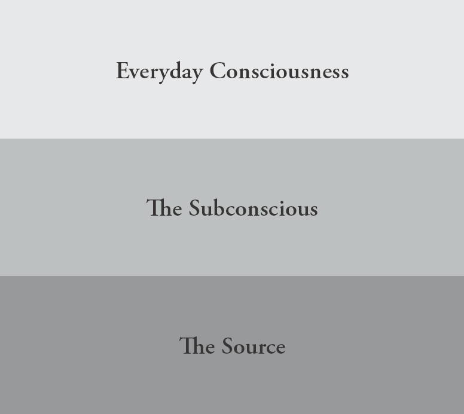

# Chapter 7 — The Realm of Power

*From: Shinzen Young — The Science of Enlightenment: How Meditation Works (Sounds True, 2016)*

CHAPTER SEVEN

The Realm of Power

One way to view the path to enlightenment is as a journey—a journey from the surface of consciousness to the Source of consciousness. A reasonable question to ask when undertaking a physical journey is, “What general direction are we going? East? Southeast? West?” In the same way, we might also ask what general direction we are traveling in when we make the *spiritual* journey. People often think of spirituality as a kind of turning away from the world. Geometrically speaking, that would represent a turn of 180 degrees to face in a direction that is the opposite of the world. In that way of thinking, the spiritual journey is away *from* the world. But the way I like to describe the spiritual journey is not as a 180-degree turn, but as a 90-degree turn. Here’s what I mean.

We can look upon consciousness as having layers to it, like a many-layered cake or the geological strata of the earth. Our ordinary experience of self and world arises on the topmost layer. Our spiritual Source is the deepest layer. In between surface and Source, there is a thick slab that must be traversed. Therefore, a turn in the direction of our spiritual Source would be a turn of 90 degrees. Instead of just moving along the surface of experience, we begin to *burrow down* into experience toward its Source.

While moving through the intermediate level between surface and Source, some people encounter unusual phenomena which may be either frightening, empowering, or both. In this chapter, I would like to talk about those phenomena and how to work with them. But first let’s look a little more closely at this tri-level model.

Figure 2: A Three-Level Model of the Spiritual Journey

As I mentioned, the surface level (everyday consciousness) represents the world of ordinary experience. What characterizes ordinary experience? We have the sense that there is a thing inside us called a self; the self is surrounded by other selves that are also things; material objects are solid; and these are all fundamentally separate. Moreover, events in the objective world and subjective states of thought and emotion arise and pass along a continuum of time that seems to extend in a linear way endlessly forward and backward. Finally, ourselves, the other selves, and material things seem to be embedded in a rigid framework of always-existing space. So at the surface of consciousness, self is a thing, objects are solid, space is rigid, and time is a two-way, endless line. This is the ordinary view of things; it’s the perspective that is natural at the surface of consciousness.

There is nothing intrinsically problematic about this ordinary perspective. The problem comes when it is the *only* perspective available to a person, which unfortunately is the usual case. Enlightenment, or freedom, comes when we also have a complementary perspective that we can access at any time. To have this complementary perspective, we must come into direct contact with the third level of consciousness, the Source. When we are in direct contact with the Source, self is not perceived as a separate particle, objects are not perceived as solid, and space becomes elastic and can collapse to a dimensionless point, taking everything with it to the Unborn. And time is cyclic—self and scene arise from and return to that unborn Source over and over. We can call this perspective many things, such as God, Brahman, the Tao, the Unborn, the Undying, the nature of Nature, Zero, Emptiness, Completeness. The words don’t really matter. What matters is direct contact.

In some descriptions, the Source is referred to as our “ground of being.” This is a phrase used by Meister Eckhart, one of the greatest of the Christian mystics. Born in 1260, he was the bishop of Cologne, a Dominican friar, a famous academic, and also a great meditation master. Contemporary influential protestant theologians like Paul Tillich still use Meister Eckhart’s metaphor of God as the ground of being.

If we want to think of that third layer as the ground of being, that is okay. The only difficulty with that terminology is that when we say the word “ground,” we tend to think of something that is extended in space and somehow solid. The ground of our being is the source of the experience of space: it generates the experience of space, it’s not inside of space. And it is anything but solid! However if we think of the word “ground” as referring to that from which things arise and to which they return, then ground is a good word for God. If you want to think of God as your ground, then you can call that experience God. On the other hand, if you’re a skeptical materialist, you probably don’t like words like ground or Source or God. No problem. Call it something else. Call it a state of maximal conscious rest, or the sensory analog of a physical system being at its ground state, or call it “regression in service of the ego.” You can call it whatever you want, as long as you actually *experience* it. Anyone who has had the experience is allowed to describe it any way they want. (For the record, I think of myself as a skeptical rationalist. It’s just that I happen to be quite comfortable with the G-word. And I’m also a materialist, but for me, matter tastes like Spirit.) The pre-Socratic Greek philosopher Heraclitus put it nicely when he said, “It is both willing and unwilling to be called by the name Zeus.”

Moving from ancient philosophy to modern science, consider the word “ground” as it’s used in physics. The “ground state” of a system means the state of greatest stability, deepest repose. Certainly, this would be a good description of what the human mind/body system experiences when we have direct encounter with the Source of consciousness.

One of the fundamental themes in physical science is that things tend toward their ground state. In a similar way, we human beings are constantly pulled toward the Source. It’s like a gravitational force, but we may not be aware of it, and a lot of times, we scramble in the opposite direction. But given half a chance, we will sink down into our ground state. By “half a chance,” I mean the systematic cultivation of concentration, clarity, and equanimity. In other words, meditation is what gives us the chance to feel the tug of the ground state, of God. The ground state is formless—it is in fact a doing, an activity, not a thing—and that’s why to describe it as a layer or level of consciousness is useful but also misleading.

So one way to describe the spiritual path is as a journey from ordinary surface experience to the ground state, the Source of all states, both ordinary and altered. The vehicle we ride, that carries us from the surface down through intermediate layers of consciousness to Source, is that of concentration, clarity, and equanimity. Now let’s talk about some experiences that may occur along the way.

The Subconscious: The Intermediate Layer

When I speak of the intermediate realm of consciousness, it may sound abstract and esoteric, but what I am calling the intermediate layer is none other than what is commonly referred to in the West as the subconscious.

It’s very revealing to look at how the subconscious is described by various schools of psychology. The notion of the subconscious came into the Western world through the works of Freud and Jung, but these two men had radically different points of view. Freud described it metaphorically as a dark cellar filled with ghosts, demons, cobwebs, snakes, and centipedes. It is where the repressed poison and pain of our life, the trauma of unresolved past experiences, fixations, and conflicts are stored.

From the perspective of Buddhism, there is a certain truth to this model because the aspect of the subconscious that Freud was interested in corresponds to what in Buddhism is called the *samskaraskandha*—the “aggregate of (limiting) conditionings.” According to Buddhism, it is conditionings that prevent our ordinary consciousness from directly contacting *nirvana*, that is, the Source. If you have something between your two hands, like a ball, it will impede your hands from touching each other. The impurities and blockages in the intermediate realm are like that ball, separating the everyday mind from the enlightened mind. If we were to pop the ball, then the two hands could automatically come together and stay together.

From this perspective, the path is really not so much a journey from surface to Source, as a clearing away of what lies between surface and Source. As a result of this clearing, surface and Source fall together, and we find ourselves constantly touching transcendence in each moment of ordinary experience.

So one view of the intermediate realm is that it is where the blockages lie, and when we direct the light of sensory clarity and pour the water of equanimity into any experience, the brightness and softening percolate down into those areas to clarify and dissolve the blockages. The surface gets closer and closer to the Source until, finally, the two touch in the experience of enlightenment. From that time on, the ordinary experience of day-to-day life rests in contact with the ground of all experience.

Freud’s student Carl Jung took a somewhat different direction in his understanding of the subconscious. For Jung, the subconscious is the world of archetypes, the world wherein angels, ancestors, entities, and spirit beings are real and relevant. From the Buddhist perspective, this point of view also has truth to it because the subconscious can be looked upon as the *sambhogakaya*—“the realm of archetypal bodies.” When journeying from surface to Source, some people encounter celestial and empowering experiences in the sambhogakaya. It may seem to them as though they are meeting spirit beings or angels, visiting the worlds of the gods, or achieving psychic and healing powers. It may seem to them that they can remember former lives, or that they can travel outside of the body.

Whether such powers actually exist in the objective world, I don’t know, although in general I tend to be rather skeptical. But one thing is certain. In this intermediate realm, some people do get very vivid subjective experiences of these phenomena. Likewise, I don’t pretend to know the ontological status of spirits and entities. They can certainly seem real—if by real we mean a sensory experience that can be extremely vivid and tangible. But sensory vividness is not the same thing as objective existence. For me, the really important question is how to harness these phenomena toward optimal growth. To do that, we need to become somewhat indifferent to what they mean but utterly fascinated with how they move.

Considering what we’ve said so far, the intermediate layer could paradoxically be described as either the realm of power or the realm of blockage.

It is of the utmost importance to remember that not everyone encounters unusual experiences or special powers when they traverse this intermediate realm. Neither does everyone meet the archetypal monsters of their impurities there. Many people travel the whole way from surface to Source and are never aware of anything other than very ordinary experiences, like the touch of their clothes, the aches in their body, or the sensation of their breath. That’s all that ever happens to them, and yet they are able to traverse the whole territory.

I frequently hear people say things like, “I’ve been meditating for a number of years, but I’ve never had any unusual experiences or strong emotions. What am I doing wrong?” I ask them if they are consistently bringing concentration, clarity, and equanimity to ordinary experiences, and if they notice whether their day-to-day life has been improving. If they answer yes to both questions, I tell them that they are doing fine. Extraordinary phenomena are not required for extraordinary growth.

When people *do* have unusual experiences in the intermediate realm, those experiences may manifest in a variety of ways. People may see weird images, monsters, or skeletons. They may get very hot or cold, shake, move in strange ways, or become hypersensitive and emotional for no apparent reason. These represent samskaras or blockages percolating up from the subconscious and becoming tangible. If you happen to have such experiences, the trick is just to observe them with concentration, clarity, and equanimity so that the purification process continues. No matter how intense, bizarre, or powerful an experience may be, it can only come up as some combination of physical sensation in the body, emotional sensation in the body, mental image activity, and internal talk—our old friends.

Just as some people have very ordinary experiences for the whole path, and some people encounter weird and disturbing content, so others have heavenly, entertaining, empowering visions. And some people get a mixture of both hellish and celestial experiences. There are many possibilities, and we should never think that, just because we haven’t encountered an archetype or left our body, we are not making progress. Neither should we think that we must eventually uncover hidden monsters or have unusual sensations in order to make progress.

Whatever the experiences may be, it’s how we relate to them that really matters. Indeed, it could be said that one litmus test for spiritual maturity is how a person relates to the experiences of the intermediate realm. The spiritually mature person treats all events encountered on the path from surface to Source in exactly the same way: greeting them with concentration, clarity, and equanimity. The spiritually *immature* person develops cravings and aversions with respect to these phenomena. They fear certain types of experiences and desire other types of experiences. Or they worry they won’t have any special experiences at all.

There was once a Zen monk who started to get very successful in his meditation. He could sit for hour after hour and day after day without moving. He got so deep in meditation that even the gods started to admire him. They would show up every day and shower flowers on his head, give him offerings, and worship him. This went on for a while. Finally he yelled, “Beat it, guys, you’re boring me!” and whacked them away with his stick.

This story is told to Zen monks as a caveat: do not develop a craving for even the most celestial content that may come your way during meditation.

Eruptions in the Everyday

For the first five or six years of my practice, I never had any unusual experiences. My main focus was just trying to deal with the pain in my legs and the wandering in my mind. But then I started having intense visionary experiences. Visionary material is very interesting; once it gets going, it’s not necessarily limited to when you’re sitting in formal practice. The images can erupt during your waking hours and may continue while you’re just walking around.

In my case, these image eruptions consisted of huge and very realistic-looking insects. They weren’t like static photographs, they moved with the distinctive articulate quality that you would find in a living arthropod. They were extremely vivid and lifelike, and worse still, gigantic! They seemed to be five or six feet long, actually.

These visions continued for a year while I was in graduate school. I’d be walking to classes, and there would be these monstrous vermin greeting me along the path.

It was not a problem though. In fact, I functioned quite well. It wasn’t like a psychotic or schizophrenic state, it was just a phenomenon of the intermediate realm. I interpreted it to mean that I had dropped into that realm and some material was presenting itself. I just treated it like any other mental image activity—it was just a form of visual thinking. I tracked how my awareness moved over the surface of the images (whether it was drawn to the right, left, top, or bottom). I attempted to look at the images with equanimity. If the images created emotional reactions in my body, I would try to bring concentration, clarity, and equanimity to those sensations, noticing the flavor—fear, sadness, interest, for example—the location, the felt size, shape, and whether the impact was local in my body, global over my whole body, or both.

Because these arthropods moved in realistic ways, I would also focus on their movement qualities as a flow of expansion and contraction. I paid close attention to how parts of the images would fade in and fade out. I was very cognizant of the Flow of impermanence in the images. In other words, I simply applied the standard mindfulness procedures to these weird hallucinations. I didn’t try to ignore them. I didn’t try to suppress them. I did not take messages from them. I just recycled them as objects of the meditation practice, no matter how bizarre they got.

As this went on, I discovered something rather extraordinary. You might assume that when you bring mindfulness to this kind of material, it would automatically get weaker and start to dissolve. And in fact, that’s what often happens. But the opposite can also occur. Sometimes the more matter-of-fact you become, the more *realistic* the hallucinations become. And that’s what started happening for me. I thought through the logical consequences of this. If I continued to bring concentration, clarity, and equanimity to this phenomenon, just give it total permission to do its thing, then it might become so vivid that it would be as tangible as the so-called real world itself. I decided to let that happen, and this led to a great insight.

Impermanence is not merely a characteristic of sensory experience. Impermanence is also the creative flow of nature that ferments sensory experience into existence moment by moment. The more concentration, clarity, and equanimity I brought to this visionary material, the more I was able to literally see how the Flow of impermanence was molding these visions into realness. When I completely surrendered to the Flow of expansion and contraction, it began to manifest that parallel reality the same way it manifests ordinary reality.

That’s why those images were becoming so realistic: I was able to detect the creative Flow of impermanence animating them from within, like the hand of some invisible puppeteer, expanding and contracting to bring life to an empty puppet. The more I let that Flow move without blocking it, the more it functioned creatively as it does in nature, and therefore the more realistically it manifested visual material. It occurred to me that if I were to completely unblock the Flow, the manifestations could become as vivid and tangible as the real world.

You might think this would make a person freak out. In fact, quite the opposite should occur: it gives you liberating insight. You see how impermanence creates something that is obviously not there. A sort of figure-ground reversal takes place. It’s not that you become convinced that the hallucinations are real, rather you understand how conventional reality is in some ways a hallucination.

Relating to the Realm of Power

As I mentioned, an important gauge of a person’s spiritual maturity lies in how they relate to the phenomena of the intermediate layer, the realm of power. Indeed, we can classify an individual’s spiritual journey based on how they react to this realm. First let’s examine three extreme cases: Freak-Out, Diversion, and Plumb Line. After that, we’ll look at another possibility: a compromise scenario.

Freak-Out

In the case of freak-out, you start out living on the surface of consciousness, just like everyone else. Then for some reason—a cultivated path, some special condition like an illness, trauma, sleep deprivation, drugs, fasting, or maybe just due to random chance—you turn 90 degrees from the surface and start to go down into the intermediate layer. There you encounter some unusual phenomena and get frightened. Like somebody whose head is held under water, you flail around to get back to the surface of consciousness, to ordinary reality, gasping to catch your breath. The experience is so uncomfortable that you decide to never risk repeating it. You stay on dry land for the rest of your life. You are too scared to go back down, so you never bore through the intermediate realm to what is beyond. This represents an extreme relationship: you turn 90 degrees (downward), start to move toward the Source, get freaked out, and turn around 180 degrees (upward) in order to get back to normalcy.

Diversion

In the case of diversion, as you start to move toward the Source, you encounter phenomena of the intermediate realm, and you like them. They’re interesting; they’re empowering; they’re enticing. So you move out into that realm and begin to explore.

But here’s the problem. Remember that in order to move toward the Source, you turned 90 degrees from the surface. If you get preoccupied with the phenomena of the intermediate realm, you have turned 90 degrees again, and are now traveling *horizontally* out into that realm, rather than *vertically* down to the Source. It’s like you were driving from San Francisco to Los Angeles for an important meeting. But along the way, you turned here and there to entertain yourself with the scenery. Somewhere along the line, *without realizing it,* you’re no longer moving north to south. Instead, you’re now headed east toward Denver!

Once you go out horizontally into the intermediate realm, there is no end to the new and interesting stuff you can experience: encounters with angels or entities, psychic abilities, out-of-body experiences, bright lights or colors, past lives, weird internal sounds. The scenery is really cool, but you’re never going to make that important meeting. You just keep moving out further and further, parallel with the surface, having new and fascinating experiences but not getting any closer to the Source.

This is the territory of the New Age. Of course “New Age” is just a twentieth-century term for a phenomenon that liberation teachers have been warning people about for millennia. But let’s be clear about one thing. These phenomena themselves are not a problem. The problem comes when you start putting all of your spiritual energy into them. When that happens, you believe you are making spiritual progress, but in fact you are not, and worse still, you don’t realize it. The vocabulary used by those who travel around in the realm of power is sometimes quite close to the vocabulary used by those who plummet straight to the Source.

In previous epochs, for every person who was interested in traversing the vertical path to the Source, there were many more people who were interested in the ego ornaments of the realm of power. This makes perfect sense. The realm of power runs parallel to ordinary surface experience, so it is easier for people to relate to. In the world of surface, conventional reality, people are preoccupied with status. The realm of power can feed that preoccupation, just as “mating and rating” do on the surface. That’s why getting caught in the realm of power is referred to as spiritual materialism. I sometimes joke that I would like to have a T-shirt that says: “My entity is older than your entity.” Of course, this is just a joke, but that is exactly what the status trip of the realm of power sounds like. I’ve heard that some people have even claimed proprietary rights and tried to service mark the entities that they purport to channel!

Don’t get me wrong. As I mentioned, the powers themselves are not a problem. In fact, *they’re a good thing.* They’re a good sign on your journey because they are a way to contact deep levels of the mind. If you’re seeing the forms of specific spirits, it means that you’re getting close to the formless Great Spirit. Moreover, you can use the powers from this realm to help other people, but that’s best done *after* you’ve plummeted through this realm to the Source rather than before.

Wuguang, my teacher at the Buddhist temple in Taiwan, was a Tantric wizard. His primary interest was in acquiring psychic powers, but that interest had developed *after* his enlightenment. He cultivated these powers because that was his way of helping people. It was the normal thing to do given his cultural background. He cured illnesses, located runaway children, and exorcised people who were demonically possessed. It wasn’t because he was particularly interested in this *mishegas* for himself. He was already liberated; he lived in the Source. If you’re interested in this stuff, it’s okay to put a lot of time and energy into it *after* you have contacted the Source. Because only then do you see the powers for what they truly are. You realize where they ultimately come from and what they’re really made of.

Zen masters often refer to the intermediate realm as *makyo. Ma* is an abbreviation for *mara,* sometimes translated as “devil.” But in this context, mara just refers to blockages or impediments, things that can “bedevil” one’s progress. The Zen masters don’t want students to get tripped out on the content of the intermediate realm, thereby missing their golden opportunity to get an insight into the nature of nature. It’s very affirming to have angels shower you with flowers, but that is a trivial experience relative to the affirmation that comes when you directly contact the Source of all things—the formless womb whose peristalsis forms angels, demons, flowers, and garbage cans.

Plumb Line

In this reaction to the realm of power, no matter what arises, you greet it with concentration, clarity, and equanimity. If nothing special happens, you pay attention to the nothing special with concentration, clarity, and equanimity. If something special happens, and it is frightening and painful, you greet it with concentration, clarity, and equanimity. If something special happens, and it is blissful and affirming, you greet it with concentration, clarity, and equanimity. You make no distinctions. You just auger down, deeper and deeper, until you touch the Formless—the place from which both conventional reality and altered reality arise.

A good historical example of Plumb line is Saint John of the Cross, a Christian mystic poet who lived in sixteenth-century Spain and belonged to the Carmelites—one of the main meditative orders in the Roman Catholic Church. Saint John described the journey to the Source as a going up rather than a going down, but the idea is the same. He metaphorically described the path in his *Ascent of Mount Carmel.* In it, he drew a picture of Mount Carmel and the different stages of the ascent from the base to God at the peak. Each stage on the way he labeled *nada* (nothing) and at the very top he wrote *y en monte nada* (“and at the peak, nothing”). Of course, the nada of that peak is a very, very special nothing; it is the divine Nothing, which is sometimes called emptiness in Buddhism. It is a nada that is simultaneously a *todo* (everything).

Saint John wrote that if you want to climb Mount Carmel, you cannot let yourself be frightened by the beasts you may encounter along the way, neither can you stop to pick any flowers. This description beautifully captures the essence of spiritual maturity. You are not freaked out by the weirdness, and you’re not decorating yourself with cool stuff either.

The Compromise Scenario

Between the extreme of going horizontal, which we might call the path of sorcery, and the extreme of going straight down, which we might call the path of liberation, there lies a continuum of in-between angles—oblique paths, so to speak. An oblique path has two components of motion. There is some horizontal movement into exploring the phenomena of the intermediate realm, but at the same time, there is some vertical movement toward the spiritual Source. An oblique path could be 45 degrees, where you move into the realm of power and toward the Source simultaneously and at the same speed. Or you could be angled a little bit more toward sorcery (more horizontal, going broader out into phenomena) or angled a little bit more toward liberation (more vertical, going deeper, approaching the Source). Many people follow one of these oblique angles; they are not on a spiritual materialism trip, nor are they just purely plummeting to the Source. So we can measure a continuum of spiritual orientations, depending on how close your vector is to vertical. As a general rule, the more vertical, the more mature. *This range of oblique angles between pure power tripping and pure purification represents the spectrum of classical shamanism.*

I like to refer to shamanism as the *really* old-time religion of this planet. Even relatively old religions like Hinduism and Judaism have only been in existence for a few millennia. Shamanism, the natural religion of tribal humanity, is at least twenty thousand years old, probably much older—no one knows for sure. In the big picture, the natural religion of our species has been shamanism, and compared to it, all the other religions of the world are new kids on the block.

Within shamanic cultures, there is often a distinction between the path that is oriented toward the special powers and the path that is oriented toward ego transcendence. The path of the powers brings knowledge of the spirits. But ego transcendence brings knowledge of the Great Spirit.

The only shamanic practice that I have had any direct contact with is one from North America, specifically that of the Lakota, or Western Sioux. In their language, they have two words: *pejuta-wichasha* and *wichasha-wakan. Pejuta* means an “herb” or a “medicine” or a “power,” and *wichasha* means a “person,” so pejuta-wichasha is literally a medicine person or person with power. *Wakan,* on the other hand, means the Great Mystery or the Great Spirit, so a wichasha-wakan is a spiritual leader, a person whose shamanic ordeals have taken them beyond the ego.

In Carlos Castaneda’s early books, his teacher, Don Juan, lays it on the line in a way that couldn’t be clearer. He uses exactly the same language that my teacher Wuguang used. Don Juan says that there are some people who have power, but they can’t see. There are some people who can see, but they don’t have power. And there are some people who can both see and have power. What Don Juan means by “seeing” is of course insight—understanding how consciousness works at the deepest level.

The Buddha said essentially the same thing. He had a student who was an *arhat,* which means a fully enlightened, fully liberated person, like himself. But the populace doubted that this person was an arhat because he didn’t have any special powers. The people came to the Buddha and said, “What’s the deal here? He can’t levitate; he can’t tell us the future; he can’t heal people.” The Buddha responded by saying that they didn’t understand the nature of the path. Liberation is dimensionally independent from these powers. The Buddha confirmed that the arhat was liberated, but his path had not involved any unusual experiences.

By way of contrast, the Buddha had another student who was a master of the psychic powers, but had very little actual liberation. He wasn’t enlightened, but he thought he was hot stuff. So the Buddha used a clever strategy to demonstrate this confusion to him at a gut level. The story goes that this particular student’s psychic powers were so great that when he visualized phenomena, other people around saw them too. The Buddha said, “I have a request. Use your psychic powers to manifest a tiger.” The student readily complied, magically evoking a ferocious tiger from the ethers. It was so real that he became terrified of his own creation. Then the Buddha said, “You see, you are not what you thought you were. You are not liberated. You are not yet free from fear.”

Upaya: Using the Powers for Liberation

It might sound like I’m warning against the phenomena of the realm of power, speaking of them as a bad thing. But actually, it’s quite the opposite: contacting such unusual experiences can potentially be a good thing from the viewpoint of our ultimate goal. This is because if you happen to experience any of these phenomena, it’s a sign that you have gone deep into consciousness, and therefore, if you bring the qualities of concentration, clarity, and equanimity to that experience, you will be able to purify yourself at a very deep level.

In other words, I am suggesting a sort of reverse way of looking at the power phenomena. The usual way that people view these phenomena is to see them as a conduit that carries messages from the deep mind to the surface. I suggest that the reverse way of looking is more productive. Power phenomena represent a conduit that can carry clarity and equanimity from the surface down into the deep mind—giving it what it needs to untie its own knots, to self-purify. The most important thing in working with unusual phenomena or altered states is to see them as a convenient venue for reaching and liberating the depths of your consciousness. Viewed this way, they become what in

Buddhism is called upaya. This word is usually translated as “skillful means,” but a more contemporary and idiomatic translation might be “working smart.”

There are several ways to work smart with the realm of power. Let’s consider some specific cases. Suppose that you’re meditating, and you experience dramatic heat, or nectar-like energy circulating through your whole body. From the perspective of mindfulness practice, we would view this as a manifestation of anicca, or impermanence. Instead of getting tripped out on the sensation itself, the intrinsic *content* of the experience, become fascinated with the changing *contour* of the experience. You track the undulation or vibratory movement moment by moment. You see the experience as a verb, not a noun, a doing, not a thing. This will bring insight into impermanence down to a “cellular level” of your being, and move you in the direction of that formless doing that is the Source.

Or suppose that you get the impression that you have left your body. There is something significant about this experience, and there is something not so significant. Unfortunately, people often focus on the insignificant part and fail to utilize the significant part. The insignificant part is the impression that you can move around outside your body. The significant part is that you have entered a state of radical equanimity, a deeply detached witness-state from which you can observe your thoughts and body sensations with great matter-of-factness. Almost everyone who has out-of-body experiences gets tripped out on the entertaining impression that they can move around outside their body. Almost no one thinks of it as a platform from which to do systematic deconstructive observation, and that’s sad, because they miss a golden opportunity. By focusing on the transient impression that you have become free of your body, you miss your chance to get the transformative insight that *you were never trapped there to begin with!*

How about the experience of reading people’s minds or remembering former lives? When people have experiences like this, they are touching the part of the deep mind that is a sort of universal mind. There is a window of opportunity here as well, a chance to experience oneness with all minds, all lives—past, present, and future, mystic as well as real. In this case, the oneness is an expansion of consciousness to encompass all possible experience, without getting fixated in any one particular experience. By getting overly involved in the impression of being able to read specific minds or remember specific incarnations, you lose the opportunity to have the experience of embracing all minds and incarnations. If you do get the sense that you know what other people are thinking or can remember other lives, notice how spacious your consciousness is getting, and give it permission to get even bigger—so big that it literally becomes space itself, viewing everything, gazing at no particular thing. Then you will experience what in traditional Buddhism is referred to as the formless absorption state (jhana) called boundless consciousness.

Some people have experiences of intense pleasure or ecstatic bliss during practice. Some even say that the goal of meditation is to experience such pleasure. However, the goal of meditation is subtly but significantly different: it is to transform your relationship to pleasure, so that any kind of pleasure brings profound fulfillment. Bringing concentration, clarity, and equanimity to pleasure vastly elevates the fulfillment that pleasure delivers. If what you are focusing on happens to be the intense pleasure of meditative bliss, then this will retrain your “fulfillment circuits” at a cellular level. In fact, when you read the original sermons of the Buddha that appear in the early portion of the Pali Canon, there is much talk about how nirvana is experienced when you break through the highest meditative bliss.

Bliss during meditation is a great thing. Experience it tangibly as a body sensation and track your level of equanimity with it. Notice how every once in a while, you will greet a wavelet of bliss without any tightening around its arising, or any grasping around its passing. When that happens, notice how much more deeply fulfilling that detached pleasure is. In this way, the bliss of meditation becomes more a source of insight and purification and less a source of entertainment and craving.

Bliss is sometimes paired with the phenomenon of light. The light which may sometimes appear in the intermediate realm can be very intense. Perhaps you have experienced something like this. Have you ever half woken up from sleep and become aware of bright light that is not external? That’s what I’m talking about. In the Christian tradition, the experience of bright light during meditation was referred to as “the uncreated light of Mount Tabor.” Christian contemplatives believe that this light is what Jesus experienced during the Transfiguration that took place on Mount Tabor, a hill located in Israel near the Sea of Galilee. So they look upon that light as a special grace. But they also say that for true union with God, you must go beyond the light and into the darkness.

That is true. If you happen to experience luminosity in your meditation, look at it very, very carefully. You’ll see that it arises due to incredibly subtle and rapid vibrations. In other words, within it can be found an almost inconceivably fine-grained vibratory flavor of impermanence. As you focus more and more on its subtle impermanence, the light breaks up, and you go beyond the light to the Source that is beyond dark or bright.

Finally, what if you see angels, allies, ancestors, entities, or avatars?

It’s fine to sometimes use these archetypes as a conduit to get information *from* the depths, but I recommend that you mostly use them as a conduit to bring clarity and equanimity *to* the depths. Become fascinated with how they move, and less tripped out with what they mean. Then you will be able to see the hands of the formless puppeteer, literally animating the images from within—the doingness that is the Great Spirit that lies behind the somethingness of any specific spirit.

This is how to work smart in the realm of power: use the phenomena as platforms to reach and unlock the flow of Source.

Meditation teachers tend to fall into three categories vis-à-vis how they deal with the intermediate realm. Zen or vipassana teachers tend to caution people about it. Hindu or Tibetan teachers tend to be positive about it. Personally, I like to take the middle ground. It’s good that you are experiencing the realm of power. For one thing, it is a sign that you are dropping deep, and for another, it’s a platform from which you can do some very profound insight and purification work. But in order to do that, you have to be able to treat it like any other phenomenon. Break it up into body sensation, mental image, and internal talk, then break those up into waves of impermanence, and then watch where the waves go to when they cease. When you are directing attention to the place where things go when they cease, you are directing attention toward the Source where things come from when they arise.

Now you have a three-layered model of consciousness that can be used as a map of the spiritual path. In traditional Buddhism, these three layers are referred to as the *trikaya,* which in Sanskrit means three bodies: *nirmanakaya, sambhogakaya,* and *dharmakaya.* Nirmanakaya: the phenomena of the surface, which we are all aware of. Sambhogakaya: the phenomena of the intermediate realm, which I’ve described here in some detail. Dharmakaya: the Source itself, the formless womb whose peristalsis gestates time, space, self, and world into existence. It expands and contracts and gives birth to gods, ghosts, angels, avatars, saints, sinners, garlands, and garbage cans.
